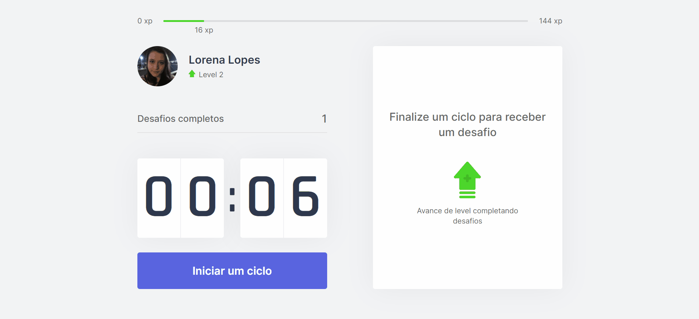

# moveit
Project move.it from Rocketseat's NLW#04

## Objective
The app idea is being like a pomodoro but also like a game, where you will have to complete the cycles to level up, and also with little exercises that you will have to do between cycles, so you will never be a lot of time only seated in front of a computer, without moving.

## Tecnologies used
- Typescript
- React.js
- HTML
- CSS

## Visit the website
https://moveit-jade-theta.vercel.app/  
Notice that the first cycle is set to 6 seconds so that you will not have to wait much to test the app.

## Demo

